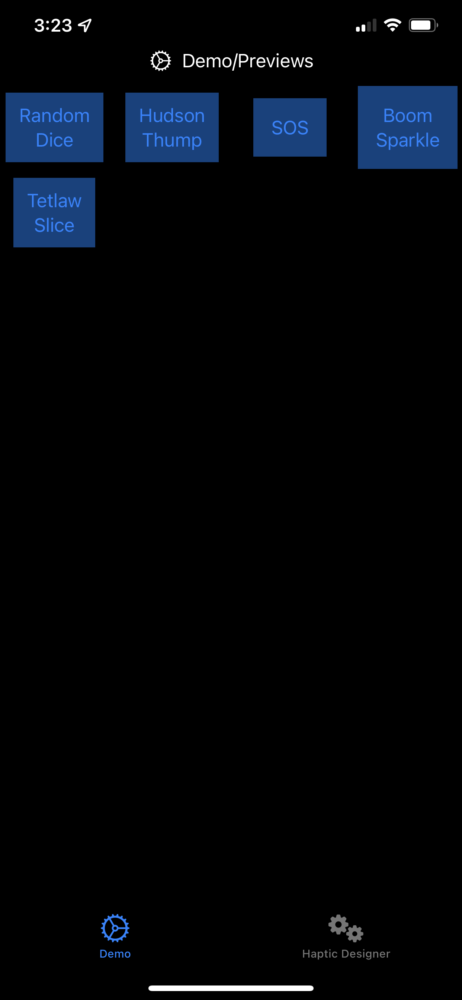
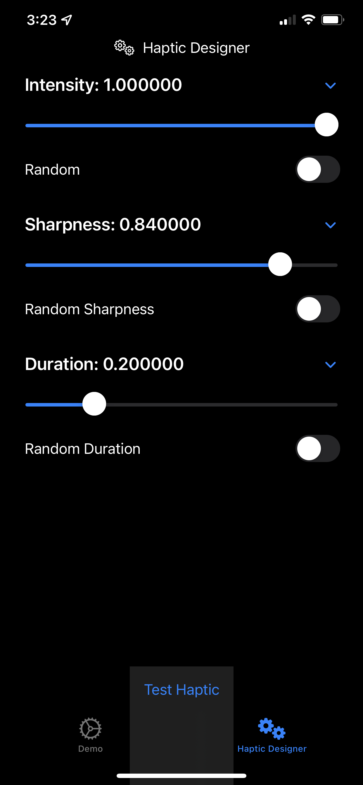

# CoreHapticsTests
*Work in progress*

This is an ios app designed to make core haptics more simple to run in an app. 

Core haptics is difficult and clunky to use, this program is aimed at letting people create haptic patterns and feel them on the phone before exporting them for use in other apps.

## Main page
The main page will have buttons and labels that will let the user of the app feel the various haptics stored in and enabled by the HapticManager class

TODO: Add a system that will read the data file and load in custom user made haptic events

## Editor
*NOTE Not Yet Implemented*

This page will let a user play with settings and design a new haptic.

TODO: 
1. Add duration effect
2. Add multiple momentary / timed
3. Create visual interface
4. Create system to help place and overlap haptics
5. Make system to save the users work to a file
6. Create solid method for exporting the datafile (through something like the ios share interface) for use in xcode projects using [PeteBits package](https://github.com/PeterH33/PeteBits) or any other system that will use the file type

